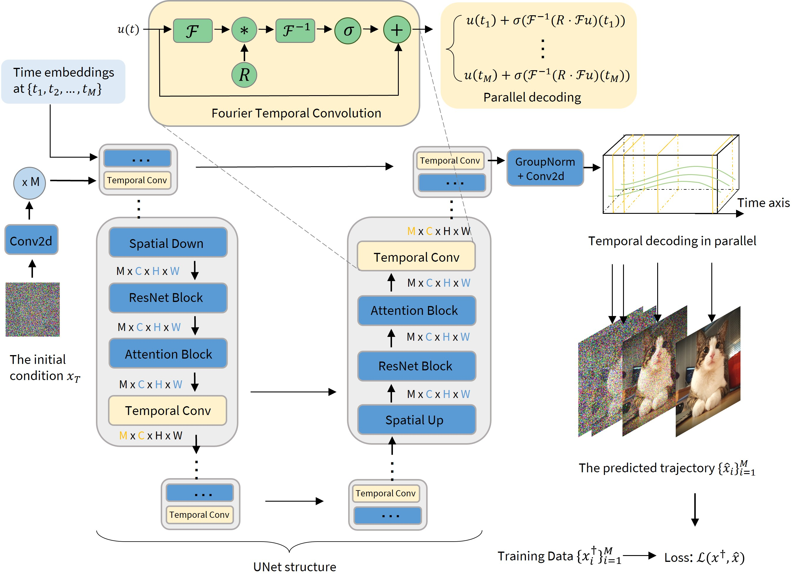

# Fast sampling of diffusion models via operator learning

Code for [Preprint](https://arxiv.org/pdf/2211.13449.pdf)

<center>

</center>

## Requirements
Docker: 
- Ensure that NVIDIA container runtime is installed. 
- Use the Dockerfile in this repo. 

## Generated trajectory data
- CIFAR10
    - Trajectories with quadratic time steps: https://dsno.s3.us-west-2.amazonaws.com/cifar_origin/quad.zip
    - Trajectories with uniform time steps: https://dsno.s3.us-west-2.amazonaws.com/cifar_origin/uniform.zip

- ImageNet64: uniform time steps https://dsno.s3.us-west-2.amazonaws.com/imagenet/imagenet16_data.zip

## Results

|        | CIFAR10-original data | CIFAR10-DSNO | ImageNet64-original data | ImageNet64-DSNO |
|--------|-----------------------|--------------|--------------------------|-----------------|
| FID    | 2.51                  | 3.78         | 2.70                     | 7.83            |
| Recall | -                     | -            | -                        | 6.119           |


## Train
Unconditional generation model. The following run gave the best FID of 3.78 on CIFAR10 within 400k iterations (72 hours on 8 A100 GPUs). 
```bash
python3 train_cifar.py --config configs/cifar10-dsno-t4.yaml --num_gpus 8
```
 
Conditional generation model. The experiments on ImageNet64 require multi-node training (6-7 days on 64 V100 GPUs with mixed precision training). The following script is just an example on single node with mixed precision. 
```bash
python3 train_imagenet.py --config configs/imagenet64-dsno-t4.yaml --num_gpus_per_node 8 --amp
```

PS: you can add `--log` and configure the `log.entity` key in the corresponding `yaml` file to turn on wandb for logging.

## Evaluation
We use the [EDM's evaluation code](https://github.com/NVlabs/edm) to report FID. We use [ADM evaluation code](https://github.com/openai/guided-diffusion/tree/main/evaluations) to report Recall. 

Example of class-conditional generation: 
```bash
python3 generate_imagenet.py --config configs/imagenet64-dsno-t4.yaml --ckpt [path to checkpoint]
```

## Code structure

```markdown
│   Dockerfile
│   README.md
│   train_cifar.py
│   train_imagenet.py
|   generate_imagenet.py          # example of class-conditional generation
|   generate_cifar.py             # example of unconditional generation
│   
├───configs
│       cifar10-dsno-t4.yaml      # example of configuration file for unconditional dsno on cifar10
│       imagenet64-dsno-t4.yaml   # example of configuration file for class-conditional dsno on ImageNet64
│       
├───models
│       layers.py
│       layersmt.py
│       tddpmm.py       # architecture of dsno
│       up_or_down_sampling.py
│       utils.py
│
└───utils
        dataset.py
        data_helper.py
        distributed.py
        helper.py
        loss.py
```